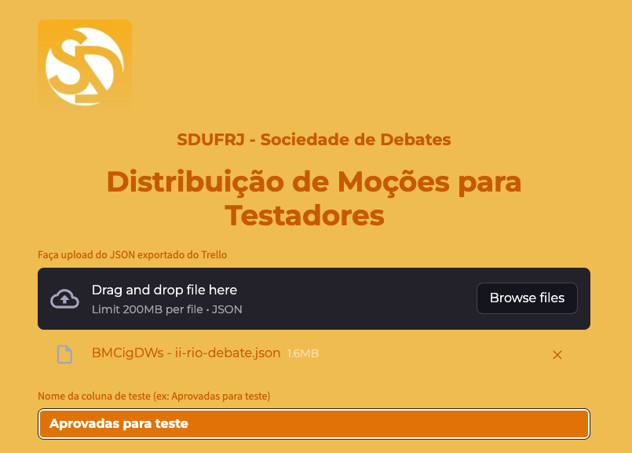

# 🟧 Distribuição de Moções para Testadores - SDUFRJ

   

**Distribua moções e infoslides de forma justa, rápida e visualmente agradável!**

---

## ✨ Sobre o app

Este app Streamlit foi criado para a **SDUFRJ - Sociedade de Debates da UFRJ** e permite:

- Upload do JSON exportado do Trello
- Escolha da coluna de moções a serem testadas (nome exato dela no Trello)
- Cadastro dinâmico de DCAs e membros que não podem testar
- Sorteio automático de testadores, respeitando todas as restrições:
  - Nenhum testador pode ser o autor
  - Nenhum testador pode ser DCA junto com outro DCA
  - Nenhum testador pode estar na lista de excluídos
- Exportação do resultado em Excel
- Distribuição equilibrada: o app busca atribuir a mesma quantidade de moções para cada testador, sempre que possível, respeitando as restrições acima
- Visual moderno, responsivo e customizado nas cores da SDUFRJ

---

## 📤 Como exportar o JSON do Trello

1. Acesse o quadro do Trello com as moções.
2. No canto superior direito, clique em **“Menu”** → **“Mais”** → **“Imprimir e exportar”**.
3. Clique em **“Exportar JSON”**.
4. Um link será aberto em uma nova aba com o conteúdo JSON do quadro.
5. Salve a página como arquivo JSON (`Ctrl+S` ou `Cmd+S` e selecione o tipo “Todos os arquivos” com a extensão `.json` no final do nome do arquivo).

> ⚠️ Não é necessário editar o JSON manualmente — o app faz o processamento automaticamente.

---

## 🚀 Acesse o app online

👉 [https://atribuirtestadores.streamlit.app/](https://atribuirtestadores.streamlit.app/)

---

## 📸 Visual

---

## 🧡 Feito pela SDUFRJ

   
  <b>SDUFRJ - Sociedade de Debates</b>

---

## 📄 Licença

MIT — uma licença de código aberto permissiva que permite uso, modificação e redistribuição com poucas restrições. O software é fornecido “no estado em que se encontra”, sem garantias.

---

> Dúvidas ou sugestões? Abra uma issue ou envie um pull request!
